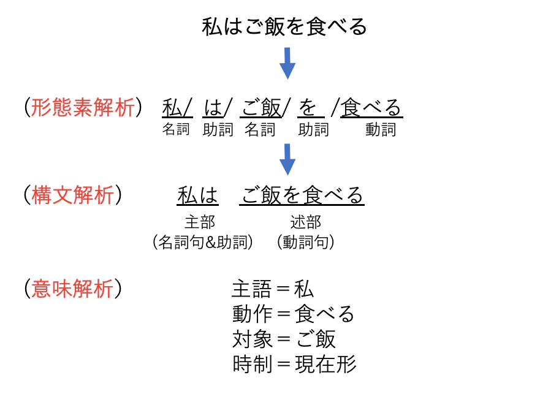
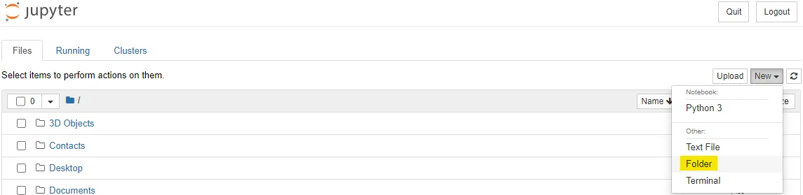
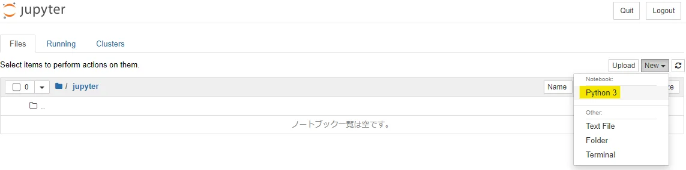

# 自然言語処理について

## 自然言語処理とは？
そもそも「自然言語」とは私たちが普段話している日本語や英語などの言語のことです。<br>
具体的な処理ですが、まず形態素解析といって文章を可能な限り小さい単位（名詞、動詞、助詞など）に分割することから始まり、次にかがり受けなどの構造を明らかにする構文解析を行います。<br>
そして最後に文の中で「誰がいつどこで何をした」という5W1Hを意味解析で判定します。<br>

<br>
参考:https://qiita.com/cr-fun/items/cc82a85c572daac0b5c5

## jupyter notebookのインストール
「Jupyter Notebook」は、PythonなどをWebブラウザ上で記述・実行できる統合開発環境です。<br>
「ジュピターノートブック」、「ジュパイターノートブック」と読みます。 

**Anaconda（Pythonのライブラリが豊富に含まれた環境）** と一緒にインストールします。 
https://www.anaconda.com/products/individual <br>

<br>

new → Folder から フォルダを作成 → チェックボックスにチェックを入れてRenameして「jupyter」というフォルダ名に変更<br><br>

続いて、新規のノートブックを作成します。「jupyter」フォルダに移動後、「New」から「Python3」をクリックして、新規ノートブックを作成します。<br>

<br>


## 実践（形態素解析）

事前にコマンドプロンプトで「janome」ライブラリをインストール
```
pip install janome

```

```
from janome.tokenizer import Tokenizer

t = Tokenizer()

s = "私はご飯を食べる。そして学校へ行く。"

for token in t.tokenize(s):
    print(token)
    
```

# スクレイピング

クレイピングとは“データを収集した上で利用しやすく加工すること”です。<br>
英単語のscraping（こすり、ひっかき）に由来し、特にWeb上から必要なデータを取得することをWebスクレイピングといいます。<br>
参考:https://www.ymori.com/books/python2nen/test2.html

HTMLを簡単に解析できるライブラリ、「Beautiful Soup」をインストール 
```
pip install beautifulsoup4
```

```
import requests
from bs4 import BeautifulSoup
# Webページを取得して解析する

load_url = "https://www.ymori.com/books/python2nen/test1.html"
html = requests.get(load_url)
soup = BeautifulSoup(html.content, "html.parser")

# HTML全体を表示する
print(soup)
```
### タグを探して表示する

```
import requests
from bs4 import BeautifulSoup

# Webページを取得して解析する
load_url = "https://www.ymori.com/books/python2nen/test1.html"
html = requests.get(load_url)
soup = BeautifulSoup(html.content, "html.parser")

# title、h2、liタグを検索して表示する
print(soup.find("title"))    # タグを検索して表示
print(soup.find("h2"))
print(soup.find("li"))
```

これだとタグつきの状態なので、ここから文字列だけを取り出すには最後に「.text」をつけます。
```
# title、h2、liタグを検索して、その文字列を表示する
print(soup.find("title").text)    # .textを追加
print(soup.find("h2").text)
print(soup.find("li").text)
```

.fi nd( "タグ名" )を使うと、要素を見つけることができるが、
取得できるのは見つかった最初の1つだけ。
一般的なWebページには要素はもっとたくさんあるので、「すべての要素」を探してみます。
<br>

```
import requests
from bs4 import BeautifulSoup

# Webページを取得して解析する
load_url = "https://www.ymori.com/books/python2nen/test2.html"
html = requests.get(load_url)
soup = BeautifulSoup(html.content, "html.parser")

# すべてのliタグを検索して、その文字列を表示する
for element in soup.find_all("li"):    # すべてのliタグを検索して表示
    print(element.text)
```
